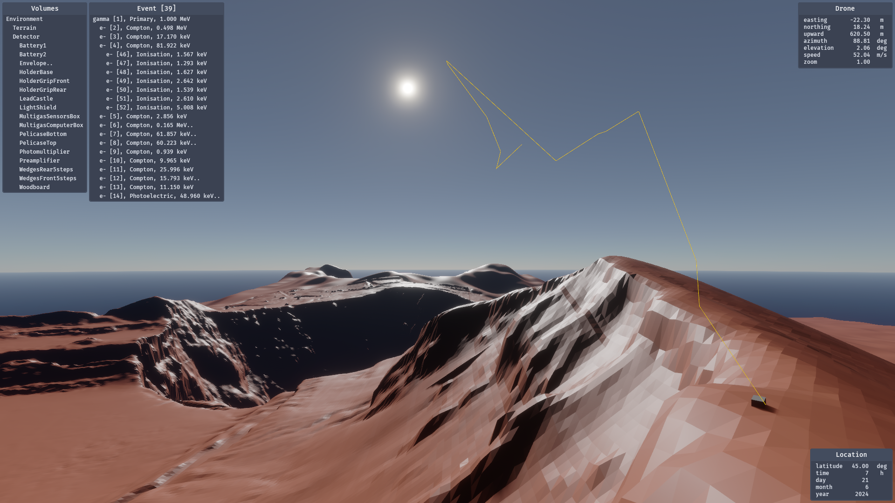

Interactive display
===================

The Calzone interactive display enables users to navigate through the Monte
Carlo :ref:`geometry <display:Volumes menu>` by controlling a drone-like
:ref:`camera <display:The Drone>`. Furthermore, Monte Carlo :ref:`tracks
<display:Tracks menu>` can be superimposed for a visual inspection.

.. important::

   The interactive display has a limited numeric accuracy of 32 bits. While this
   approach provides a convenient overview of the geometry, for a robust
   detection of overlapping volumes, the :py:meth:`Geometry.check
   <calzone.Geometry.check>` method should be used instead.

.. note::

   The interactive display is a standalone instance running in parallel with
   Python's main thread. However, there can only be one display instance per
   process. This means that launching a new display will overwrite any existing
   one (in the same process).

   Example of geometry and tracks, as visualised with the Calzone interactive
   display. The `Volumes <Volumes menu_>`_ and `Tracks <Tracks menu_>`_ menus
   are visible on the upper left corner. The `Drone camera <The Drone_>`_
   statistics are indicated on the upper right panel. Sunlight `Lighting
   <Lighting modes_>`_ is used with atmospheric scattering enabled. The
   corresponding Location settings are indicated on the lower right panel. The
   geometry is rendered in Plain `Display mode <Display modes_>`_.

Volumes menu
------------

The Volumes menu displays a list of geometry volumes, beginning with the root
volume. This list can be expanded (by left-clicking the mouse) to reveal any
daughter volumes. Holding down the :bash:`Shift` key while left-clicking a
volume name will cause the Drone to reposition to the corresponding volume.

:numref:`tab-volumes-interactions` below provides a summary of the possible
interactions with the Volumes menu.

.. _tab-volumes-interactions:

.. list-table:: Volumes menu interactions.
   :width: 75%
   :widths: auto
   :header-rows: 1

   * - Action
     - Result
   * - :bash:`LeftClick`
     - Toggle the display of all daughter volumes.
   * - :bash:`LeftClick`\ +\ :bash:`Control`
     - Toggle the display of all daughter volumes and their respective descendants.
   * - :bash:`LeftClick`\ +\ :bash:`Shift`
     - Reposition the Drone to the targeted volume.

Tracks menu
-----------

The Tracks menu displays a list of Monte Carlo tracks (as returned by the
simulation :py:meth:`run <calzone.Simulation.run>` method), commencing with the
primary track. The interactions are analoguous to those available on the Volumes
menu. For example, left-clicking on a track name reveals any daughter particles.
The potential interactions are summarised in :numref:`tab-tracks-interactions`
below.

.. note::

   In order to display Monte Carlo tracks, it is necessary to first record them
   by setting the simulation :py:attr:`tracking <calzone.Simulation.tracking>`
   attribute to :python:`True` (prior to running any simulation).

.. _tab-tracks-interactions:

.. list-table:: Tracks menu interactions.
   :width: 75%
   :widths: auto
   :header-rows: 1

   * - Action
     - Result
   * - :bash:`ArrowLeft`
     - Display the previous event.
   * - :bash:`ArrowRight`
     - Display the next event.
   * - :bash:`LeftClick`
     - Toggle the display of all daughter tracks.
   * - :bash:`LeftClick`\ +\ :bash:`Control`
     - Toggle the display of all daughter tracks and their respective descendants.
   * - :bash:`LeftClick`\ +\ :bash:`Shift`
     - Reposition the Drone to the targeted track.

The Drone
---------

The Drone is the entity responsible for controlling the display camera. It can
be moved around using the WASD keys (assuming a QWERTY layout), and rotated by
holding down the right mouse button. The available actions are summarised in
:numref:`tab-drone-interactions` below. Furthermore, the Drone statistics
(position, speed, etc.) are indicated at the top right of the display window.

.. _tab-drone-interactions:

.. list-table:: Drone interactions.
   :width: 75%
   :widths: auto
   :header-rows: 1

   * - Action
     - Result
   * - :bash:`RightClick`\ +\ :bash:`MouseMotion`
     - Rotate the Drone.
   * - :bash:`A`
     - Move the Drone to the left.
   * - :bash:`C`
     - Move the Drone downwards.
   * - :bash:`D`
     - Move the Drone to the right.
   * - :bash:`E`
     - Increase the Drone speed.
   * - :bash:`Q`
     - Decrease the Drone speed.
   * - :bash:`S`
     - Move the Drone backwards.
   * - :bash:`SpaceBar`
     - Move the Drone upwards.
   * - :bash:`W`
     - Move the Drone forwards.

Lighting modes
--------------

By default, the drone camera uses a bright overhead light to illuminate the
scene. As an alternative option, sunlight illumination, with or without
atmospheric scattering, can be utilised. Pressing the :bash:`p` key enables the
user to cycle through the lighting modes.

Activation of the sunlight lighting function will open a Location panel in the
bottom right corner of the display window. The lighting parameters (latitude,
time, etc.) are reported on this panel. To edit these settings, simply click on
the corresponding value. For an overview of the available interactions, refer to
:numref:`tab-lighting-interactions` below.

.. _tab-lighting-interactions:

.. list-table:: Lighting interactions.
   :width: 75%
   :widths: auto
   :header-rows: 1

   * - Action
     - Result
   * - :bash:`LeftClick`
     - Enter (if on a location setting value) or Exit (otherwise) the edit mode.
   * - :bash:`P`
     - Toggle the lighting mode.
   * - :bash:`Return`
     - Exit the edit mode (if in edit mode).

Display modes
-------------

By default, plain solids are rendered as opaque. While this is a realistic
rendering, it may not be convenient in some circumstances. Therefore,
alternatively, solids can also be rendered as transparent (using Blending or
Premultiplication). Additionally, the solid-mesh wires can be displayed for gas
volumes only (which are invisible otherwise), or for all volumes. These display
options can be selected using the :bash:`PageDown`, :bash:`PageUp` and
:bash:`Shift` keys, as detailed in :numref:`tab-display-interactions` below.

.. _tab-display-interactions:

.. list-table:: Display interactions.
   :width: 75%
   :widths: auto
   :header-rows: 1

   * - Action
     - Result
   * - :bash:`ArrowDown`
     - Decrease the transparency (in Blend or Premultiplied mode).
   * - :bash:`ArrowUp`
     - Increase the transparency (in Blend or Premultiplied mode).
   * - :bash:`PageDown`
     - Switch to the previous display mode.
   * - :bash:`PageDown`\ + \ :bash:`Shift`
     - Switch to the previous wireframe mode.
   * - :bash:`PageUp`
     - Switch to the next display mode.
   * - :bash:`PageUp`\ + \ :bash:`Shift`
     - Switch to the next wireframe mode.

.. ============================================================================
.. 
.. URL links.
.. 
.. ============================================================================

